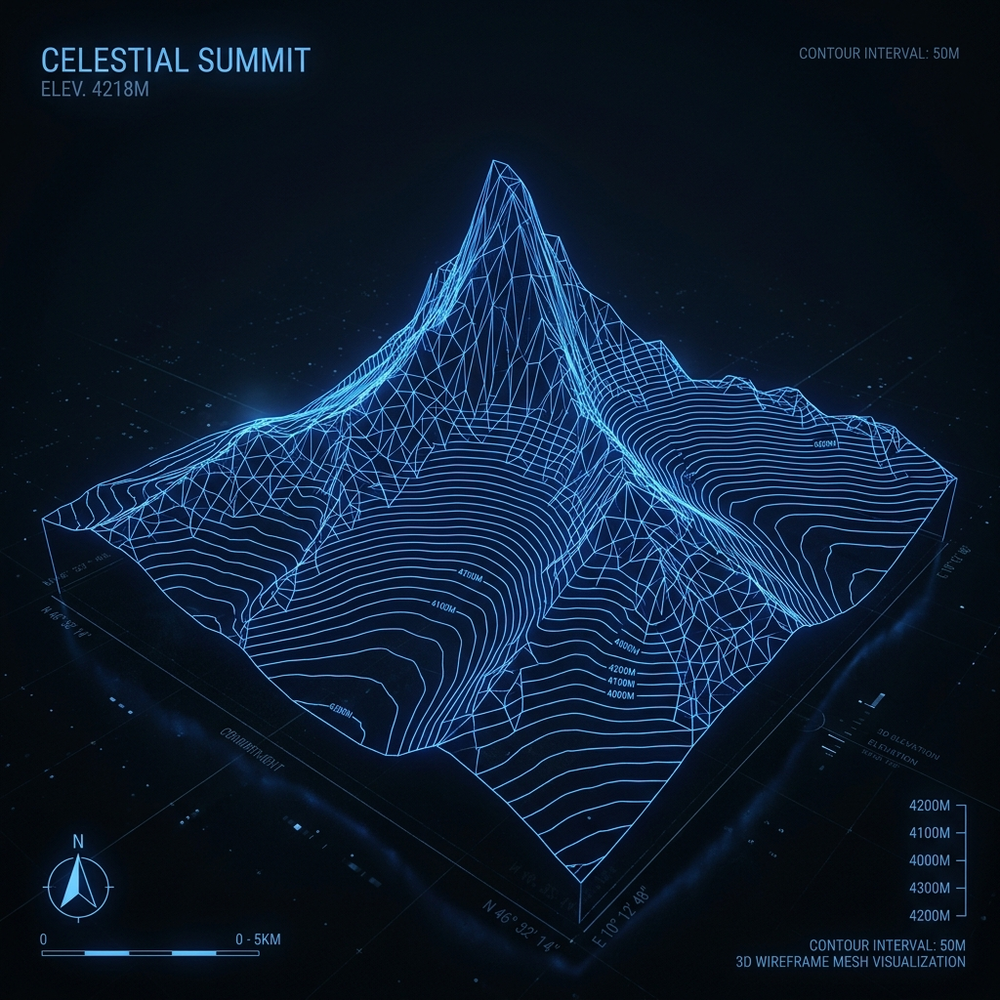

# 🗺️ Raster-to-Mesh: High-Performance Terrain STL Generator



A memory-efficient, Python-powered pipeline for converting **French Geographic Institute (IGN)** GeoTIFF elevation data into 3D printable STL files.

---

## 🚀 Key Features

- **Streaming Architecture**: Process massive datasets with a minimal RAM footprint. The pipeline operates on spatial chunks, ensuring only a fraction of the data is in memory at once.
- **Adaptive Tessellation (RTIN)**: Utilizes the **Martini (Right-Triangulated Irregular Networks)** algorithm for T-junction-free, adaptive meshing of top surfaces.
- **Numba-Accelerated Kernels**: Core mathematical operations, including RTIN extraction and QEM decimation, are JIT-compiled for near-C performance.
- **Custom QEM Decimation**: Sophisticated mesh simplification using **Quadric Error Metrics** and stellar valence heuristics to achieve aggressive triangle reduction without losing detail.
- **Seamless Merging**: Automatic stitch-and-repair for multi-tile inputs, handling holes and noise in source data.
- **Side Wall & Base Generation**: Out-of-the-box support for generating manifold 3D printable "blocks" with clean sides and flat bases.

---

## 🛠️ Technical Workflow

The pipeline operates in 7 distinct phases to ensure geometry integrity and performance:

1.  **Stitch**: Memory-map and combine multiple GeoTIFF tiles into a unified elevation grid.
2.  **Repair**: In-place elevation normalization, hole-filling, and smoothing.
3.  **RTIN Top Surface**: Adaptive triangulation using Martini-style hierarchical subdivision.
4.  **Base & Walls**: Vectorized generation of side-walls and unified bottom surface strips.
5.  **Chunk Merging**: Deduplication of vertices across chunk boundaries to ensure manifold connectivity.
6.  **Global QEM Decimation**: Aggressive simplification pass to hit target triangle counts.
7.  **Normal Recomputation**: Vectorized face normal calculation for accurate shading and valid STL headers.

---

## 📦 Installation

This project requires **Python 3.11+**.

```bash
# Clone the repository
git clone https://github.com/weepper/Raster-to-mesh.git
cd Raster-to-mesh

# Create and activate virtual environment
python -m venv venv
source venv/bin/activate

# Install dependencies
pip install numpy numba rasterio requests tqdm scipy
```

---

## 🖱️ Usage

### 1. Download IGN Tiles
Prepare a text file (`dalles.txt`) containing the URLs of the tiles you wish to download.

```bash
python download_tiles.py -i dalles.txt -d input_folder -w 10
```

### 2. Generate STL Mesh
Convert a folder of GeoTIFFs into a 3D printable STL.

```bash
python generate_mesh.py input_folder output.stl \
    --resolution 1.0 \
    --width-cm 10 \
    --length-cm 10 \
    --height-cm 3 \
    --base-cm 0.5 \
    --target-faces 500000
```

### Key CLI Parameters

| Parameter | Default | Description |
| :--- | :--- | :--- |
| `-r, --resolution` | `1.0` | Grid resolution in meters. |
| `-W, --width-cm` | `10.0` | Physical output width in cm. |
| `-f, --target-faces` | `500000` | Target triangle count after decimation. |
| `-B, --base-cm` | `0.5` | Thickness of the solid base under the terrain. |
| `-T, --planar-tolerance` | `0.1` | RTIN subdivision error threshold (smaller = more detail). |

---

## 📚 Credits & Architecture

- **Martini Algorithm**: Based on the work of **Vladimir Agafonkin** for fast, T-junction-free terrain triangulation.
- **IGN Data**: Optimized for RGE ALTI® and other high-resolution French geographic datasets.
- **Numba**: JIT compilation used extensively for high-speed geospatial processing.

---

## 📝 Project Log
Detailed architectural changes and optimization history can be found in [PROJECT_LOG.md](PROJECT_LOG.md).
